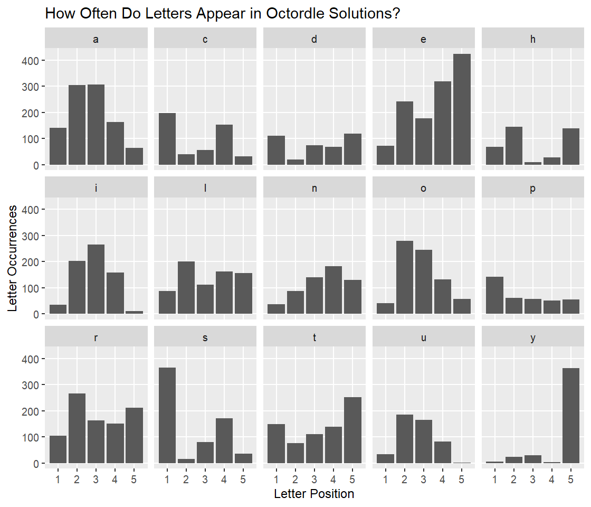

Starting Words in Octordle
================
Dan Lependorf
2022-02-28

I know I know, a million people have already “solved” the best starting
word for Wordle. But for that multiplying series of simultaneous
Dordle/Quordle/Octordle/Secordle/whatever variants, it seems to me that
as the number of puzzles grows, the more important it is to cover the
field as broadly as possible, that is, start with a two or even a three
word opener that covers all of the 15 most common letters, with no
duplicates. Can we figure out what the best three word opener is?

## Grabbing the right list of words

Sure, I could just use any reasonable dictionary, but since this has to
be a set of words that works in Octordle, why not go straight to the
source? We can grab the full list of words that are allowed in Octordle
and use that. I’m going to use the **httr** package to do most of the
heavy lifting here.

``` r
library(tidyverse)
library(httr)
library(knitr)
```

Thankfully, this isn’t anything too difficult. If you open Octordle in
any browser and take a peek at the source code, you’ll find the full
list of allowable words right there, in plain text. Let’s grab it.

``` r
octordle_url <- "https://octordle.com/?mode=daily"

octordle_source_code <- octordle_url %>%
    GET() %>%
    content("text")
```

Most of this is a bunch of code that we don’t need, but take a look at
line 856:

    function output(obj1) {
        append(acquire("out"), el("p", text(obj1)));
    }

    function remove(arr, term) {
        if (arr.indexOf(term) !== -1) arr.splice(arr.indexOf(term), 1);
    }

    allowed = "aahed aalii aargh aarti abaca abaci abacs abaft abaka abamp aband abash abask abaya abbas

There’s a big list of words that’s prefaced by `allowed =` and
surrounded by quotes. We can use some fairly simple regex to extract
that list out from the rest of this.

``` r
octordle_words <- octordle_source_code %>%    
    str_match('allowed\\s=\\s"(.*?)"') %>%
    pluck(2) %>%
    str_split(" ") %>%
    pluck(1)

str(octordle_words)
```

    ##  chr [1:10657] "aahed" "aalii" "aargh" "aarti" "abaca" "abaci" "abacs" ...

In English, that regex essentially translates to: look for anything of
the form `allowed = "stuff"` and grab the stuff in between the quotes.
That question mark inside of the parentheses capture group tells the
regex engine to be lazy about it–in other words, grab the shortest
possible match surrounded by quotes, and not to match, say, an ending
quotation mark 50 lines later.

The rest of that pipe chain above parses that long list of words into
individual words separated by spaces, and there we go, all 10,657 words
that are acceptable guesses in Octordle.

## Finding single opener words

Now that we have the list of allowable Octordle words, let’s cut that
list down to the words that only contain the 15 most common letters in
the set. First, we’ll have to split each word up into separate letters.
I’m also going to take this opportunity to convert this big character
vector into a data frame, so that it’s easier to work with.

``` r
split_words <- octordle_words %>%
    tibble(words=.) %>%
    # This map() call inside of mutate() creates a second column of a special form: a list-column. Instead of
    # a column where each entry is a single value, it's a column where each row holds a five-character vector.
    mutate(letters=map(words, ~str_split(.x, "")[[1]]))

split_words
```

    ## # A tibble: 10,657 x 2
    ##    words letters  
    ##    <chr> <list>   
    ##  1 aahed <chr [5]>
    ##  2 aalii <chr [5]>
    ##  3 aargh <chr [5]>
    ##  4 aarti <chr [5]>
    ##  5 abaca <chr [5]>
    ##  6 abaci <chr [5]>
    ##  7 abacs <chr [5]>
    ##  8 abaft <chr [5]>
    ##  9 abaka <chr [5]>
    ## 10 abamp <chr [5]>
    ## # ... with 10,647 more rows

And now, grab that column full of letters and count them.

``` r
letter_count <- split_words %>%
    unnest(letters) %>%
    count(letters, name="appearances") %>%
    arrange(desc(appearances)) %>%
    filter(row_number() <= 15)

letter_count
```

    # A tibble: 15 x 2
       letters appearances
       <chr>         <int>
     1 s              5996
     2 e              5429
     3 a              5011
     4 o              3684
     5 r              3259
     6 i              3088
     7 l              2652
     8 t              2566
     9 n              2377
    10 d              2060
    11 u              2044
    12 m              1660
    13 p              1652
    14 y              1649
    15 c              1551

``` r
best_letters <- letter_count$letters
```

What are the words in the dictionary that contain only those letters and
no duplicates?

``` r
best_words <- split_words %>%
    filter(map_lgl(letters, ~all(.x %in% best_letters)),
           map_int(letters, ~max(table(.x)))==1)

best_words
```

    ## # A tibble: 2,331 x 2
    ##    words letters  
    ##    <chr> <list>   
    ##  1 acers <chr [5]>
    ##  2 acids <chr [5]>
    ##  3 acidy <chr [5]>
    ##  4 acmes <chr [5]>
    ##  5 acned <chr [5]>
    ##  6 acnes <chr [5]>
    ##  7 acold <chr [5]>
    ##  8 acred <chr [5]>
    ##  9 acres <chr [5]>
    ## 10 acros <chr [5]>
    ## # ... with 2,321 more rows

## Finding opener word combinations

We’ve now cut the word list down from 10,657 down to 2,331. Now that we
have a list of words that contain 5 of the 15 most common letters in the
acceptable word list, we need to put them together in three word sets
that fit together and contain all 15. There are a lot of really
inefficient ways of doing this, and I’m not going to assume that this is
the fastest way (a triple cross product of 2,331 times 2,331 times 2,331
rows isn’t the easiest thing to deal with!), but here’s one way that
takes about 15 minutes.

``` r
opener_combinations <- tibble(word_1=list(),
                              word_2=list(),
                              word_3=list())

# The basic idea here: for each word, remove those letters from the list of best letters, then see which
# words can be constructed out of the remaining letters still available. Then repeat again for the second
# word, to see if any words can be constructed out of the five letters that still remain.
for (i in seq_len(nrow(best_words))) {
    word_1 <- best_words$letters[[i]]
    
    remaining_letters <- best_letters[!best_letters %in% word_1]
    remaining_words <- best_words %>%
        # This filter call both removes all words that can't be spelled with the remaining letters, and also
        # removes all words that come alphabetically before word_1. This is so we don't have duplicates
        # (since a starter of A/B/C and a different starter of A/C/B are the same thing).
        filter(row_number() > i,
               map_lgl(letters, ~all(.x %in% remaining_letters)))
    
    # If there aren't any words that can be created out of the 10 remaining letters, just skip the rest of
    # this loop iteration and go to the next one.
    if (nrow(remaining_words)==0) {
        next
    }
    
    for (j in seq_len(nrow(remaining_words))) {
        word_2 <- remaining_words$letters[[j]]
        
        still_remaining_letters <- remaining_letters[!remaining_letters %in% word_2]
        still_remaining_words <- remaining_words %>%
            filter(row_number() > j,
                   map_lgl(letters, ~all(.x %in% still_remaining_letters)))
        
        if (nrow(still_remaining_words)==0) {
            next
        }
        
        # If there are any words that can be made out of the five letters that still remain, add them to the
        # opener_combinations table.
        for (k in seq_len(nrow(still_remaining_words))) {
            word_3 <- still_remaining_words$letters[[k]]
            
            opener_combinations <- tibble(word_1=list(word_1),
                                          word_2=list(word_2),
                                          word_3=list(word_3)) %>%
                bind_rows(opener_combinations, .)
        }
    }
}
```

# Cutting the list down

Huh, there are way more valid three word combinations that have all 15
of the most common letters than I thought: 27,154. These openers aren’t
all equally useful, though, because Wordle is about more than just
identifying letters, it’s about putting them in the right places. So if
all 27,154 of these words are equally good at covering letters, we can
rank them by how often they put letters in the right places.

We’ll need to find out how often those best letters are in each
position, but first, let’s tidy up `opener_combinations` a bit.

``` r
cleaned_openers <- opener_combinations %>%
    mutate(opener_id=row_number(), .before="word_1") %>%
    pivot_longer(cols=starts_with("word"),
                 names_to="word_num",
                 values_to="letters") %>%
    unnest(letters) %>%
    group_by(opener_id, word_num) %>%
    mutate(letter_position=row_number()) %>%
    ungroup()
```

This pivot/unnest combination has transformed this:

    ## # A tibble: 27,154 x 3
    ##    word_1    word_2    word_3   
    ##    <list>    <list>    <list>   
    ##  1 <chr [5]> <chr [5]> <chr [5]>
    ##  2 <chr [5]> <chr [5]> <chr [5]>
    ##  3 <chr [5]> <chr [5]> <chr [5]>
    ##  4 <chr [5]> <chr [5]> <chr [5]>
    ##  5 <chr [5]> <chr [5]> <chr [5]>
    ##  6 <chr [5]> <chr [5]> <chr [5]>
    ##  7 <chr [5]> <chr [5]> <chr [5]>
    ##  8 <chr [5]> <chr [5]> <chr [5]>
    ##  9 <chr [5]> <chr [5]> <chr [5]>
    ## 10 <chr [5]> <chr [5]> <chr [5]>
    ## # ... with 27,144 more rows

into this:

    ## # A tibble: 407,310 x 4
    ##    opener_id word_num letters letter_position
    ##        <int> <chr>    <chr>             <int>
    ##  1         1 word_1   a                     1
    ##  2         1 word_1   c                     2
    ##  3         1 word_1   e                     3
    ##  4         1 word_1   r                     4
    ##  5         1 word_1   s                     5
    ##  6         1 word_2   d                     1
    ##  7         1 word_2   u                     2
    ##  8         1 word_2   p                     3
    ##  9         1 word_2   l                     4
    ## 10         1 word_2   y                     5
    ## # ... with 407,300 more rows

Now, with a tidy dataset to work with, how often does each of the top-15
best letters show up in each position?

``` r
best_letters_positions <- split_words %>%
    unnest(letters) %>%
    group_by(words) %>%
    mutate(letter_position=row_number()) %>%
    ungroup() %>%
    group_by(letters, letter_position) %>%
    summarize(position_count=n(), .groups="drop") %>%
    filter(letters %in% best_letters)

best_letters_positions
```

    ## # A tibble: 75 x 3
    ##    letters letter_position position_count
    ##    <chr>             <int>          <int>
    ##  1 a                     1            596
    ##  2 a                     2           1959
    ##  3 a                     3            929
    ##  4 a                     4            911
    ##  5 a                     5            616
    ##  6 c                     1            724
    ##  7 c                     2            136
    ##  8 c                     3            336
    ##  9 c                     4            259
    ## 10 c                     5             96
    ## # ... with 65 more rows

``` r
ggplot(best_letters_positions) +
    geom_col(aes(x=letter_position, y=position_count)) +
    facet_wrap(~letters, nrow=3)
```

<!-- -->

We have everything we need. Let’s grab our cleaned dataframe of opening
word combinations, join to the above table with data on how often each
letter shows up in each position, and rank the 27,154 combinations to
find the ones that get the letters in the right positions the most.

``` r
best_openers <- cleaned_openers %>%
    left_join(best_letters_positions, by=c("letters", "letter_position")) %>%
    mutate(position_count=if_else(is.na(position_count), 0L, position_count)) %>%
    group_by(opener_id) %>%
    summarize(position_sum=sum(position_count)) %>%
    arrange(desc(position_sum)) %>%
    inner_join(cleaned_openers, by=c("opener_id")) %>%
    group_by(opener_id, position_sum, word_num) %>%
    summarize(words=toupper(paste(letters, collapse="")), .groups="drop") %>%
    group_by(opener_id, position_sum) %>%
    summarize(opener=paste(words, collapse="/"), .groups="drop") %>%
    arrange(desc(position_sum))

best_openers %>%
    filter(position_sum==max(position_sum)) %>%
    kable()
```

| opener_id | position_sum | opener            |
|----------:|-------------:|:------------------|
|      3135 |        18454 | CALID/MONTY/PURES |
|      3145 |        18454 | CALID/MORES/PUNTY |
|      3152 |        18454 | CALID/MURES/PONTY |
|      4103 |        18454 | CANID/MOLES/PURTY |
|      4112 |        18454 | CANID/MULES/PORTY |
|      4113 |        18454 | CANID/MULEY/PORTS |
|      4283 |        18454 | CANTS/MURID/POLEY |
|      4390 |        18454 | CANTY/MOLED/PURIS |
|      4413 |        18454 | CANTY/MURED/POLIS |
|      4415 |        18454 | CANTY/MURID/POLES |
|      4980 |        18454 | CARED/MONTY/PULIS |
|      8844 |        18454 | COLED/MANIS/PURTY |
|      8845 |        18454 | COLED/MANTY/PURIS |
|      8910 |        18454 | COLES/MARID/PUNTY |
|      8914 |        18454 | COLES/MURID/PANTY |
|      8942 |        18454 | COLEY/MARID/PUNTS |
|      8953 |        18454 | COLEY/MURID/PANTS |
|      9480 |        18454 | CONED/MALIS/PURTY |
|      9481 |        18454 | CONED/MALTY/PURIS |
|     10160 |        18454 | CORED/MALIS/PUNTY |
|     10162 |        18454 | CORED/MANTY/PULIS |
|     12526 |        18454 | CULTS/MARID/PONEY |
|     12619 |        18454 | CULTY/MANIS/PORED |
|     12626 |        18454 | CULTY/MARID/PONES |
|     13165 |        18454 | CUNTS/MARID/POLEY |
|     13650 |        18454 | CURED/MALIS/PONTY |
|     13656 |        18454 | CURED/MANTY/POLIS |
|     13672 |        18454 | CURED/MONTY/PALIS |

All 28 of these openers are equally good at putting letters in the right
place. For my money, the one that’s easiest to remember is
**CANID/MOLES/PURTY**.
